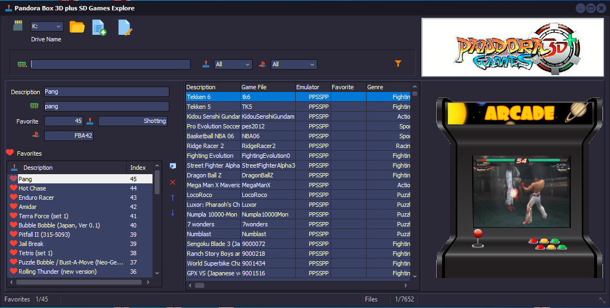

# Pandora 3D Plus SD games explore
This program helps you to add your favorite games to your Pandora Box 3D plus SD card. 

HOW TO USE:
-----------
Insert your Pandora Box 3D+ micro SD card into your PC, and then run the program.
Search for the game to add as your favorite
Double click to add it to your favorte list.

When your ready just insert the SD card once again into your Pandora3D+ and turn on. The game should appear as Favorite.

[download file here](Win32/Release/PandoraBoxEx.exe)

